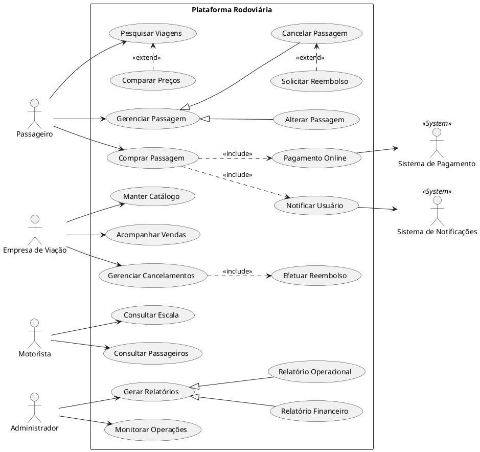

# Atividade – Diagrama de Casos de Uso (Plataforma Rodoviária)

## 1. Identificação dos Atores

Os atores representam papéis interagindo com o sistema, podendo ser usuários humanos ou sistemas externos.

- **Passageiro:** Usuário principal que utiliza a plataforma para pesquisar viagens, efetuar a compra de passagens e gerenciar suas reservas online.
- **Empresa de Viação:** Parceira da plataforma. Responsável por fornecer e cadastrar informações de viagens (rotas, horários, preços, ônibus) e gerenciar os cancelamentos, reembolsos e o acompanhamento de vendas.
- **Motorista:** Funcionário da viação. Seu papel é consultar informações sobre as viagens alocadas a ele e visualizar a lista de passageiros.
- **Administrador da Plataforma:** Responsável pela visão macro do negócio. Cuida do gerenciamento geral do sistema, do monitoramento das operações e da geração de relatórios (financeiros e operacionais).
- **Sistema de Pagamento (Ator Externo):** Plataforma terceira responsável por processar as transações financeiras das passagens online.
- **Sistema de Notificações (Ator Externo):** Serviço terceiro (E-mail ou WhatsApp) responsável por enviar alertas, comprovantes e atualizações aos usuários.

---

## 2. Identificação dos Casos de Uso

Abaixo estão listados os principais Casos de Uso agrupados por Atores primários (aqueles que iniciam a ação):

- **Passageiro:**
  - `Pesquisar Viagens`
  - `Comparar Preços e Horários`
  - `Comprar Passagem`
  - `Gerenciar Passagem` (Base para Cancelar, Alterar e Solicitar Reembolso)
  
- **Empresa de Viação:**
  - `Manter Catálogo de Viagens` (inclui cadastro de rotas, horários, preços e ônibus disponíveis)
  - `Acompanhar Vendas`
  - `Gerenciar Cancelamentos e Reembolsos`
  
- **Motorista:**
  - `Consultar Escala de Viagens`
  - `Consultar Lista de Passageiros`
  
- **Administrador da Plataforma:**
  - `Monitorar Operações do Sistema`
  - `Gerar Relatórios` (Base para Relatórios Financeiros e Operacionais)

- **Sistema de Pagamento e Sistema de Notificações** interagem de forma secundária com casos de uso já iniciados (ex: `Efetuar Pagamento Online`).

---

## 3. Relacionamentos (Baixo Acoplamento e Alta Coesão)

Os seguintes relacionamentos de *include*, *extend* e *generalização* foram aplicados para garantir modularidade (coesão) e reaproveitamento de fluxo:

- **Inclusão (`<<include>>`):**
  - **`Comprar Passagem` <<include>> `Efetuar Pagamento Online`**: Não há como finalizar a compra sem passar pelo processamento da plataforma de pagamento.
  - **`Comprar Passagem` <<include>> `Notificar Usuário`**: O fluxo de compra obrigatoriamente aciona o serviço de e-mail/whatsapp.
  - **`Gerenciar Cancelamentos e Reembolsos` <<include>> `Efetuar Reembolso`**: A aprovação do cancelamento por parte da viação aciona o processo financeiro de estorno.

- **Extensão (`<<extend>>`):**
  - **`Comparar Preços e Horários` <<extend>> `Pesquisar Viagens`**: O passageiro pode pesquisar de forma direta, mas tem a *opção* de comparar diferentes viações (cometa, 1001, catarinense) caso deseje.
  - **`Solicitar Reembolso` <<extend>> `Cancelar Passagem`**: É um fluxo condicional, pois nem sempre o passageiro que cancela solicita reembolso via sistema (depende das políticas da passagem).

- **Herança (Generalização):**
  - **Casos de Uso de Gerenciamento de Passagem:** `Cancelar Passagem` e `Alterar Passagem` são casos específicos que herdam de um caso de uso genérico `Gerenciar Passagem`.
  - **Casos de Uso de Relatórios:** `Gerar Relatório Financeiro` e `Gerar Relatório Operacional` herdam do caso genérico `Gerar Relatórios` (ação exclusiva do Administrador).

---

## 4. Diagrama de Casos de Uso (Código-fonte)

Abaixo está o código-fonte UML estruturado em `PlantUML` que representa graficamente a modelagem acima.
*(Instruções para renderizar no diagrams.net: Vá em **Organizar > Inserir > Avançado > PlantUML** e cole o código abaixo).*

