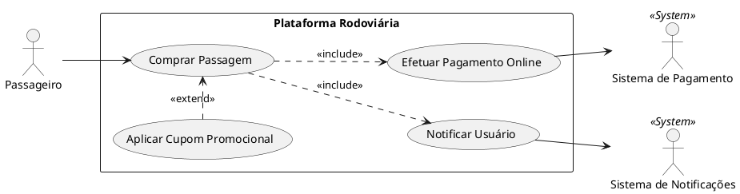
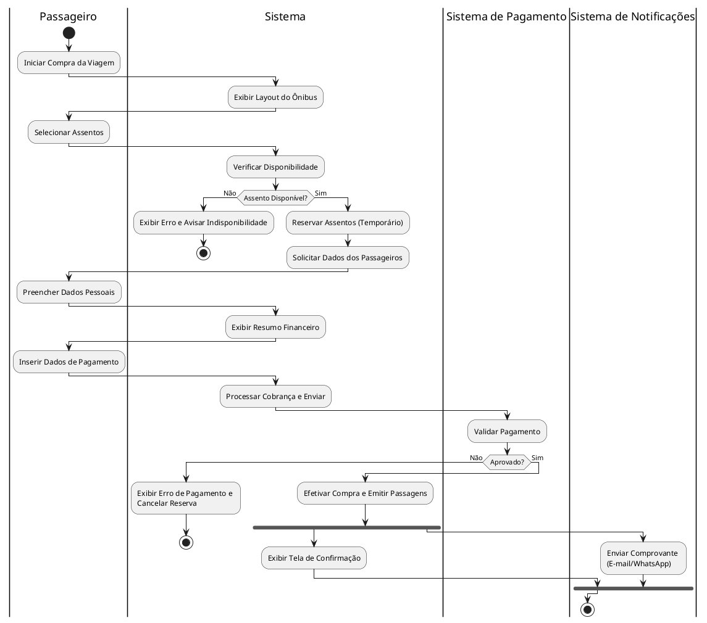

# Atividade – Descrição Textual de Casos de Uso e Diagrama de Atividades

## 1. Descrição Textual: Comprar Passagem

- **Ator Principal:** Passageiro
- **Atores Secundários:** Sistema de Pagamento (Ator Externo), Sistema de Notificações (Ator Externo)
- **Pré-condições:** O Passageiro deve ter efetuado uma pesquisa e selecionado uma viagem (origem, destino, data e viação).
- **Pós-condições:** O pagamento é aprovado, a passagem é emitida, os assentos ficam bloqueados definitivamente e o usuário recebe a notificação da compra com o bilhete.

### Cenário de Sucesso Principal (Fluxo Básico)
1. O Passageiro inicia o processo de compra para a viagem selecionada.
2. O sistema exibe o layout do ônibus e solicita a escolha dos assentos.
3. O Passageiro seleciona os assentos desejados.
4. O sistema verifica a disponibilidade, reserva os assentos temporariamente e solicita os dados dos passageiros (Nome, Documento).
5. O Passageiro preenche os dados solicitados.
6. O sistema exibe o resumo financeiro (valor das passagens, taxas) e solicita a forma de pagamento.
7. O Passageiro seleciona o método e informa os dados de pagamento.
8. O sistema envia a cobrança para o **Sistema de Pagamento** (*<<include>> Efetuar Pagamento Online*).
9. O Sistema de Pagamento autoriza a transação.
10. O sistema efetiva a compra, emite as passagens e aciona o **Sistema de Notificações** (*<<include>> Notificar Usuário*).
11. O sistema exibe a tela de confirmação de sucesso com os links para os bilhetes.

### Fluxos Alternativos
- **[FA01] Aplicar Cupom Promocional:** No passo 6, o Passageiro insere um código de desconto. O sistema valida, recalcula o valor final e atualiza a tela do passo 6 (*<<extend>> Aplicar Cupom Promocional*).
- **[FA02] Voltar para alterar assentos:** No passo 6, o Passageiro decide que quer mudar de lugar. O sistema descarta a reserva temporária e retorna ao passo 2.

### Fluxos de Exceção
- **[FE01] Assento Indisponível (Concorrência):** No passo 4, se o assento escolhido tiver acabado de ser comprado por outra pessoa, o sistema exibe um aviso de erro e retorna ao passo 2.
- **[FE02] Pagamento Recusado:** No passo 9, se o Sistema de Pagamento recusar a transação (ex: sem limite no cartão), o sistema alerta o Passageiro e retorna ao passo 6 para que ele tente outra forma de pagamento.
- **[FE03] Tempo Limite de Reserva Esgotado:** A qualquer momento entre o passo 4 e 9, se o Passageiro demorar mais do que o tempo limite configurado (ex: 10 minutos), o sistema expira a reserva temporária, avisa o usuário com uma mensagem de timeout e cancela a operação, retornando ao início.

---

## 2. Diagrama de Casos de Uso (Zoom no caso Comprar Passagem)

Cole o código abaixo no [Draw.io](https://app.diagrams.net/) (Organizar > Inserir > Avançado > PlantUML):

---

## 3. Diagrama de Atividades

Cole o código abaixo no Draw.io para gerar o fluxograma particionado (Swimlanes):

