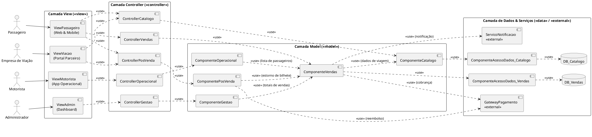
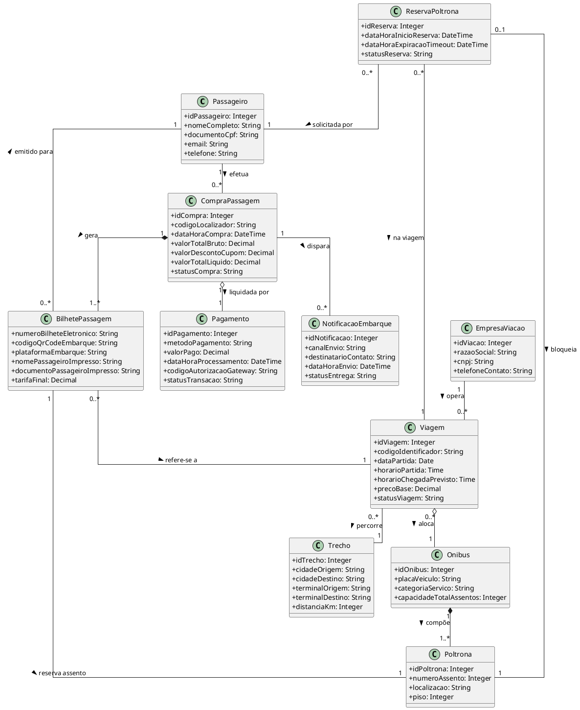

# Atividade – Identificação de Componentes e Classes do Sistema

**Disciplina:** SSC0124 — Análise e Projeto Orientados a Objetos (APOO)  
**Docente:** Profa. Dra. Lina Garcés  
**Aluno:** Rafael Feltrim — **N° USP:** 15942812  
**Contexto:** Plataforma de Venda de Passagens Rodoviárias Integrada (ClickBus)  

---

## 1. Identificação dos Componentes Explícitos do Sistema

Aplicando os princípios de **Alta Coesão** e **Responsabilidade Única (SRP)**, os Casos de Uso que manipulam e processam informações de domínio afins foram agrupados nos seguintes componentes explícitos:

1. **Componente de Catálogo e Viagens (`ComponenteCatalogo`):**
   - *Responsabilidade:* Centralizar a gestão de ofertas de transporte, abrangendo rotas, linhas, horários, preços base, cidades atendidas e ônibus disponibilizados pelas empresas parceiras.
2. **Componente de Vendas e Passagens (`ComponenteVendas`):**
   - *Responsabilidade:* Orquestrar todo o ciclo de checkout da compra, seleção de poltronas, reserva temporária (bloqueio com timeout concorrente), faturamento e emissão do bilhete com integração de mensageria.
3. **Componente de Pós-Venda e Atendimento (`ComponentePosVenda`):**
   - *Responsabilidade:* Gerenciar as ocorrências e alterações posteriores à emissão dos bilhetes, incluindo cancelamento, remarcação de passagens, apuração de multas e solicitação de estornos.
4. **Componente Operacional e Embarque (`ComponenteOperacional`):**
   - *Responsabilidade:* Fornecer dados operacionais em tempo real para a equipe de bordo (motoristas e despachantes), tais como escalas de viagem e lista de passageiros embarcados.
5. **Componente de Gestão e Auditoria (`ComponenteGestao`):**
   - *Responsabilidade:* Consolidar métricas operacionais, volume de vendas, faturamento geral e relatórios analíticos para os administradores da plataforma.

---

## 2. Casos de Uso sob Responsabilidade de Cada Componente

| Componente Explícito | Casos de Uso sob sua Responsabilidade | Descrição do Domínio |
| :--- | :--- | :--- |
| **`ComponenteCatalogo`** | • `Pesquisar Viagens` • `Comparar Preços e Horários` • `Manter Catálogo de Viagens` (Rotas, Horários, Preços, Ônibus) | Consulta e manutenção da malha viária e disponibilidade de horários. |
| **`ComponenteVendas`** | • `Comprar Passagem` • `Selecionar Assentos` • `Realizar Reserva Temporária` • `Efetuar Pagamento Online` • `Notificar Usuário` | Concretização comercial da venda, reserva de assentos e cobrança. |
| **`ComponentePosVenda`** | • `Gerenciar Passagem` (Base) • `Cancelar Passagem` • `Alterar Passagem` • `Solicitar Reembolso` • `Gerenciar Cancelamentos e Reembolsos` • `Efetuar Reembolso` | Atendimento pós-compra, políticas de remarcação e estornos. |
| **`ComponenteOperacional`** | • `Consultar Escala de Viagens` • `Consultar Lista de Passageiros` • `Acompanhar Vendas das Viagens` | Acompanhamento logístico e apoio ao motorista/empresa. |
| **`ComponenteGestao`** | • `Monitorar Operações do Sistema` • `Gerar Relatórios` (Base) • `Gerar Relatório Financeiro` • `Gerar Relatório Operacional` | Governança corporativa, auditoria e inteligência de negócios. |

---

## 3. Identificação dos Componentes Implícitos do Sistema

Os componentes implícitos são subsistemas técnicos e de infraestrutura indispensáveis para atender aos requisitos de desempenho, concorrência, segurança e integração externa, que não aparecem diretamente como bolhas no diagrama funcional de Casos de Uso:

1. **`DB_Catalogo` (Banco de Dados de Catálogo):** Repositório otimizado para consultas rápidas de trechos, itinerários, frotas de ônibus e tabelas tarifárias.
2. **`DB_Transacional_Vendas` (Banco de Dados de Vendas e Reservas):** Repositório com suporte a transações ACID estritas para controle de concorrência em poltronas e garantia de não sobreposição de compras (*double booking*).
3. **`DB_Auditoria_Analytics` (Repositório de Dados Operacionais):** Armazenamento de eventos para relatórios gerenciais e histórico de logs.
4. **`GatewayPagamento` (Módulo Externo de Cobrança):** API/SDK externa (ex.: Cielo, Stripe, Adyen, PIX) responsável pela autorização de cartões e liquidação financeira.
5. **`ServicoNotificacao` (Módulo Externo de Mensageria):** Provedores de comunicação multicanal (ex.: Twilio WhatsApp API, AWS SES / SendGrid) para envio de bilhetes e alertas de atraso.
6. **`MessageBroker_Notificacoes` (Fila/Barramento de Mensagens Assíncronas):** Middleware de enfileiramento (ex.: RabbitMQ, AWS SQS) que desacopla o checkout da compra do disparo de e-mails/mensagens, garantindo resiliência.
7. **`ComponenteAutenticacao_Seguranca`:** Mecanismo centralizado de autenticação, RBAC (Role-Based Access Control) e geração de tokens JWT para passageiros, viações, motoristas e administradores.

---

## 4. Diagrama de Componentes UML seguindo o Padrão Arquitetural MVC

Conforme as diretrizes da Aula 09 (Slides 24 e 28), o sistema é estruturado em camadas no padrão **MVC**:
- **View (`<<view>>`):** Interfaces dedicadas para cada perfil de usuário.
- **Controller (`<<controller>>`):** Orquestradores que recebem requisições da View, aplicam regras de negócio e acionam o Model.
- **Model (`<<model>>`):** Componentes especialistas do domínio do problema.
- **Data / Services (`<<data>>` / `<<service>>`):** Componentes de acesso a dados persistentes e integrações com serviços terceiros.

### Código PlantUML (Importar em *Organizar > Inserir > Avançado > PlantUML* no [diagrams.net](https://app.diagrams.net/)):

---

## 5. Seleção de Componente, Identificação de Classes de Domínio e Atributos

**Componente Selecionado:** `ComponenteVendas` (Vendas e Passagens)  
*Justificativa:* É o núcleo de valor do negócio, responsável pelo checkout, concorrência de poltronas, transações financeiras e emissão de bilhetes.

### a. Identificação das Classes por Categoria de Domínio (Diretrizes da Aula 09):
- **Coisas Tangíveis / Físicas:** `Onibus`, `Poltrona`
- **Perfis de Usuários / Atores de Domínio:** `Passageiro`, `EmpresaViacao`
- **Transações Comerciais:** `CompraPassagem`, `Pagamento`, `ReservaPoltrona`
- **Conceitos Canônicos / Entidades do Domínio:** `BilhetePassagem`, `Viagem`, `Trecho`
- **Comunicações / Eventos:** `NotificacaoEmbarque`

### b. Definição de Atributos Tipados das Classes (Sem Métodos)

1. **`Passageiro`**
   - `idPassageiro: Integer`
   - `nomeCompleto: String`
   - `documentoCpf: String`
   - `email: String`
   - `telefone: String`
2. **`EmpresaViacao`**
   - `idViacao: Integer`
   - `razaoSocial: String`
   - `cnpj: String`
   - `telefoneContato: String`
3. **`Viagem`**
   - `idViagem: Integer`
   - `codigoIdentificador: String`
   - `dataPartida: Date`
   - `horarioPartida: Time`
   - `horarioChegadaPrevisto: Time`
   - `precoBase: Decimal`
   - `statusViagem: String`
4. **`Trecho`**
   - `idTrecho: Integer`
   - `cidadeOrigem: String`
   - `cidadeDestino: String`
   - `terminalOrigem: String`
   - `terminalDestino: String`
   - `distanciaKm: Integer`
5. **`Onibus`**
   - `idOnibus: Integer`
   - `placaVeiculo: String`
   - `categoriaServico: String` (ex: Convencional, Executivo, Leito)
   - `capacidadeTotalAssentos: Integer`
6. **`Poltrona`**
   - `idPoltrona: Integer`
   - `numeroAssento: Integer`
   - `localizacao: String` (ex: Janela, Corredor)
   - `piso: Integer` (ex: 1 ou 2)
7. **`ReservaPoltrona`**
   - `idReserva: Integer`
   - `dataHoraInicioReserva: DateTime`
   - `dataHoraExpiracaoTimeout: DateTime`
   - `statusReserva: String` (ex: Pendente, Confirmada, Expirada)
8. **`CompraPassagem`**
   - `idCompra: Integer`
   - `codigoLocalizador: String`
   - `dataHoraCompra: DateTime`
   - `valorTotalBruto: Decimal`
   - `valorDescontoCupom: Decimal`
   - `valorTotalLiquido: Decimal`
   - `statusCompra: String` (ex: Processando, Paga, Cancelada)
9. **`BilhetePassagem`**
   - `numeroBilheteEletronico: String`
   - `codigoQrCodeEmbarque: String`
   - `plataformaEmbarque: String`
   - `nomePassageiroImpresso: String`
   - `documentoPassageiroImpresso: String`
   - `tarifaFinal: Decimal`
10. **`Pagamento`**
    - `idPagamento: Integer`
    - `metodoPagamento: String` (ex: CartaoCredito, Pix, Boleto)
    - `valorPago: Decimal`
    - `dataHoraProcessamento: DateTime`
    - `codigoAutorizacaoGateway: String`
    - `statusTransacao: String` (ex: Aprovado, Recusado, Estornado)
11. **`NotificacaoEmbarque`**
    - `idNotificacao: Integer`
    - `canalEnvio: String` (ex: Email, WhatsApp)
    - `destinatarioContato: String`
    - `dataHoraEnvio: DateTime`
    - `statusEntrega: String` (ex: Enviada, Entregue, Falha)

---

## 6. Diagrama de Modelo Conceitual em UML (Classes de Domínio e Relacionamentos)

O diagrama abaixo contempla:
- **Associações** com multiplicidades rigorosamente definidas (`1`, `1..*`, `0..1`, etc.).
- **Composição (`◆` / vínculo forte):** 
  - `CompraPassagem` é composta por `1..* BilhetePassagem` (os bilhetes emitidos pertencem exclusivamente àquela compra e não têm ciclo de vida autônomo sem ela).
  - `Onibus` é composto por `1..* Poltrona` (as poltronas fazem parte física da estrutura do veículo).
- **Agregação (`◇` / vínculo fraco):**
  - `CompraPassagem` agrega `1 Pagamento` (o comprovante da transação financeira é uma entidade que complementa a compra, mas possui registro fiscal independente).
  - `Viagem` agrega `1 Onibus` (o ônibus cumpre a escala da viagem, mas existe e opera em múltiplas outras viagens).
- **Herança / Especialização:** aplicada em categorias de assentos/veículos e tipos de transação.

### Código PlantUML (Importar em *Organizar > Inserir > Avançado > PlantUML* no [diagrams.net](https://app.diagrams.net/)):

